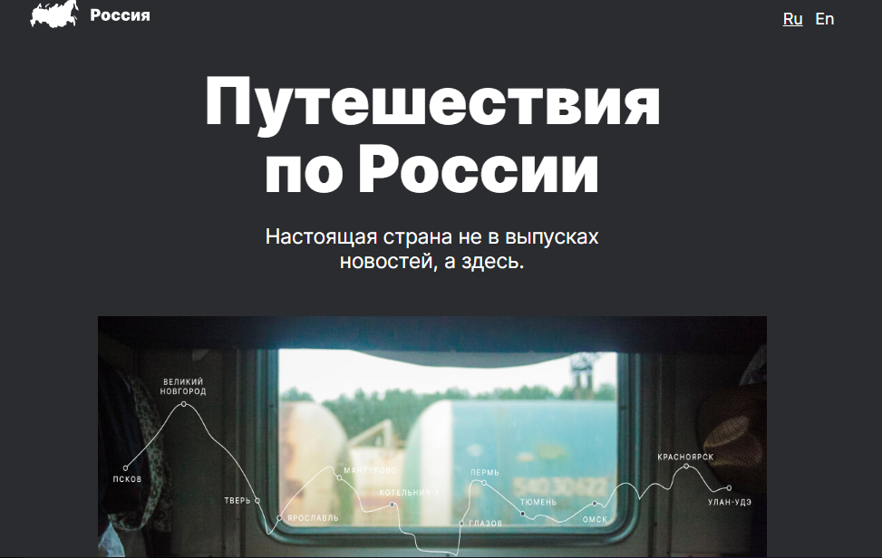

# Hi, my name is Aishat.

## This project is a "Russian travel" website.

This is a site about traveling in Russia.
It is dedicated to an overview of interesting places where you can visit.
On the site you can see photos of unique places of nature and choose the most attractive ones for yourself. In addition to an overview of the places, there is a description of how you can get to them.

##

To view the site, you just need to download it in an archived form or through a link using GIT commands.

-   [link to viewe on Github](https://github.com/homo-errantium/russian-travel)

-   [link to viewe on Github Pages](https://homo-errantium.github.io/russian-travel/)

### Technologies:

This is a simple and informative site with the ability to follow links. It is fully responsive and responsive for most popular devices. It uses _HTML_ and _CSS_. The arrangement of elements was implemented using _Grid_ and _Flex_ technology, so it will not be difficult to adapt to new devices. It uses only a few fonts and colors. However, the site is tasteful, organic and friendly looking.

### Plan/Status:

The project is completed and does not require any further work. However, I plan to add a few more pages to make the site multi-page.

thank you for watching.
