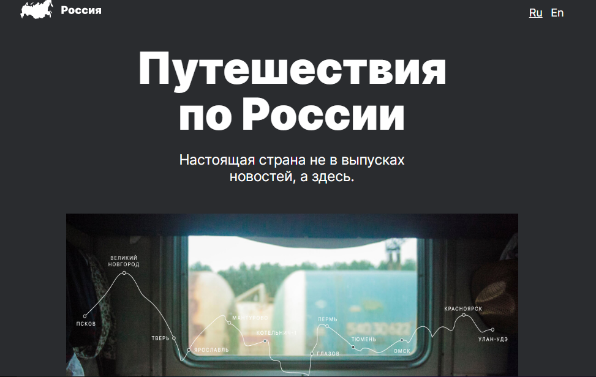

# Привет, меня зовут Айшат.

## Этот проект представляет собой сайт «Русские путешествия».

Это сайт о путешествиях по России.
Он посвящен обзору интересных мест, которые можно посетить.
На сайте вы можете посмотреть фотографии уникальных мест природы и выбрать для себя наиболее привлекательные. Помимо обзора мест, есть описание того, как до них можно добраться.

##

Для просмотра сайта вам достаточно скачать его в архивном виде или по ссылке с помощью команд GIT.
Также для просмотра сайта вам достаточно скачать его в заархивированном виде или по ссылке.

-   [ссылка для просмотра на Github](https://github.com/homo-errantium/russian-travel)

-   [ссылка для просмотра на страницах Github](https://homo-errantium.github.io/russian-travel/)

###Технологии:

Это простой и информативный сайт с возможностью перехода по ссылкам. Он полностью отзывчив и отзывчив для большинства популярных устройств. Он использует _HTML_ и _CSS_. Расположение элементов реализовано с помощью технологий _Grid_ и _Flex_, поэтому адаптироваться к новым устройствам не составит труда. Он использует всего несколько шрифтов и цветов. Тем не менее, сайт выглядит со вкусом, органично и дружелюбно.

###План/статус:

Проект завершен и не требует дальнейших работ. Однако я планирую добавить еще несколько страниц, чтобы сделать сайт многостраничным.

Спасибо за просмотр.
